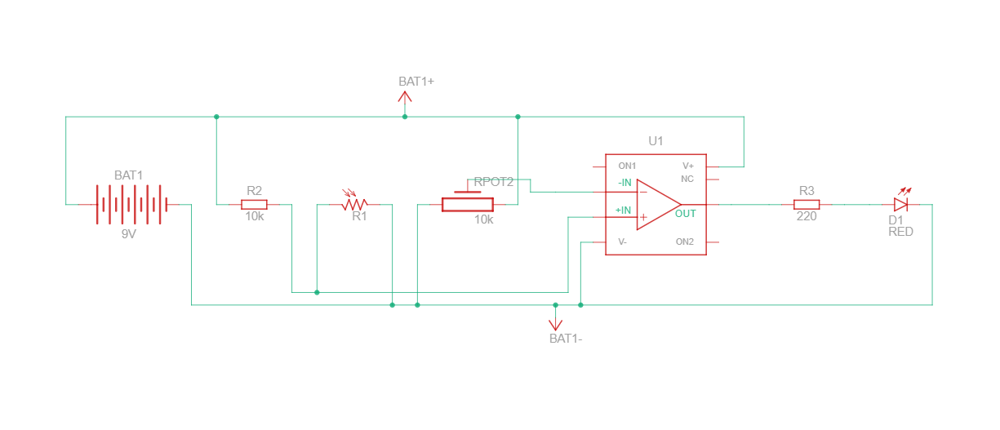

# 💡 Light-Sensitive Alarm Circuit

A comparator-based alarm circuit that activates an LED when ambient light drops below an adjustable threshold. Built using a **UA741 op-amp**, an **LDR (Light-Dependent Resistor)**, and a **potentiometer** for sensitivity control.

> 📚 Course: ECE 211 – Introduction to Electronics Engineering  
> 🏫 Egypt Japan University of Science and Technology (E-JUST)

---

## 🔗 Live Simulation

👉 [View on Tinkercad](https://www.tinkercad.com/things/gT8mdWLHCg1-light-sensitive-alarm-circuit?sharecode=F3aK2TnNz1AVtB9dsBwvnQzQl4rQcqNEV45Ourmjzhk)

---

## 📋 Overview

This project demonstrates the use of an op-amp as a **voltage comparator** to detect changes in light intensity. When light falls below a preset threshold, the circuit output switches HIGH and activates an LED alarm. The sensitivity threshold is user-adjustable via a potentiometer.

---

## ⚙️ How It Works

The circuit is built around three main stages:

**1. Voltage Divider (Sensor Stage)**  
The LDR and a 10kΩ fixed resistor form a voltage divider. As light intensity decreases, the LDR resistance increases, which raises the voltage at the divider's midpoint.

**2. Comparator (UA741 Op-Amp)**  
- The voltage divider output connects to the **non-inverting input (+)** of the UA741.  
- A potentiometer sets a **reference voltage** at the **inverting input (−)**.  
- When the LDR voltage exceeds the reference voltage (low light), the op-amp output swings **HIGH** → alarm activates.  
- In bright light, the LDR voltage stays below the reference → output stays **LOW** → alarm inactive.

**3. Output Stage**  
The op-amp output drives an LED through a 330Ω current-limiting resistor as a visual alarm indicator.

---

## 🔌 [Circuit Schematic]


---

## 🧰 Components

| Component | Value / Part | Purpose |
|-----------|-------------|---------|
| LDR | — | Light-intensity sensor |
| Op-Amp | UA741 | Voltage comparator |
| Potentiometer | 10kΩ | Adjustable reference voltage |
| Resistor R2 | 10kΩ | Voltage divider with LDR |
| Resistor R3 | 330Ω | LED current limiter |
| LED D1 | Red | Visual alarm indicator |
| Power Supply | ±9V (dual) | Op-amp power rails |
| Breadboard + Wires | — | Prototyping |

---

## 📊 Observations

| Condition | LDR Resistance | Pin 3 Voltage | Op-Amp Output | LED |
|-----------|---------------|---------------|---------------|-----|
| Bright light | Low | < Reference | LOW | OFF |
| Low / no light | High | > Reference | HIGH | ON |
| Threshold adjusted | — | = Reference | Switches | Toggles |

- Circuit successfully detected light changes and activated the alarm accordingly.
- Adjusting the potentiometer changed the trigger threshold, confirming sensitivity control.
- No false triggering observed under steady-state light conditions.

---

## 🛠️ Tools Used

- **Tinkercad** — Circuit simulation and schematic design
- **LTspice** — Circuit analysis and verification
- **Breadboard** — Physical prototyping

---

## 💡 Applications

- Automatic night lights
- Burglar alarms triggered by darkness
- Light-sensitive industrial control systems

---

## 📁 Repository Structure

```
light-sensitive-alarm/
├── README.md
├── schematic/
│   └── light_alarm_schematic.png
└── report/
    └── Light_Sensitive_Alarm_Report.pdf
```

---

## 👤 Author

**Kareem Soliman** — Mechatronics Engineering Student, E-JUST  
[LinkedIn](https://www.linkedin.com/in/kareem-04-soliman/) · [GitHub](https://github.com/Kareem-04)
